# Network Performance Tests with iperf3

## Workflow Description

This workflow runs an iperf3 network performance test on a Kubernetes cluster using a service port. The workflow collects metadata from a cluster node, as well as node-level performance metrics using Performance Co-Pilot (PCP). Additionally it generates a unique UUID to associate with the data in order to aid as an index reference when storing data.

## TODO

This workflow needs a few updates as features become available in the Arcaflow engine:

- Split iperf3 plugin into a sub-workflow
  - This needs a way to pass the kubernetes connection object to the sub-workflow
- PCP data collection should be run using smart parallelization with the iperf3 client
- PCP and metadata plugins should be scheduled using pod affinity with the iperf3 client
- Need to support pod and host network and not just service network
- Kubeconfig should be passed as a file instead of inline in the `input.yaml` file
- The iperf3 client should wait for the iperf3 server to be ready before starting

## Files

- [`workflow.yaml`](workflow.yaml) -- Defines the workflow input schema, the plugins to run
  and their data relationships, and the output to present to the user
- [`input.yaml`](input.yaml) -- The input parameters that the user provides for running
  the workflow
- [`config.yaml`](config.yaml) -- Global config parameters that are passed to the Arcaflow
  engine
                     
## Running the Workflow

### Workflow Execution

Download a Go binary of the latest version of the Arcaflow engine from: https://github.com/arcalot/arcaflow-engine/releases
 
Run the workflow:
```
$ export WFPATH=<path to this workflow directory>
$ arcaflow -input ${WFPATH}/input.yaml -config ${WFPATH}/config.yaml -context ${WFPATH}
```

## Workflow Diagram

```mermaid
%% Mermaid markdown workflow
flowchart LR
%% Success path
steps.metadata.deploy-->steps.metadata.starting
steps.metadata.cancelled-->steps.metadata.outputs
steps.service.outputs.success-->steps.iperf3_client.starting
steps.uuidgen.running-->steps.uuidgen.outputs
steps.iperf3_server.deploy-->steps.iperf3_server.starting
steps.kubeconfig.outputs.success-->steps.iperf3_server.deploy
steps.kubeconfig.outputs.success-->steps.service.starting
steps.kubeconfig.outputs.success-->steps.iperf3_client.deploy
steps.kubeconfig.outputs.success-->steps.metadata.deploy
steps.kubeconfig.outputs.success-->steps.pcp.deploy
steps.uuidgen.deploy-->steps.uuidgen.starting
steps.uuidgen.outputs.success-->outputs.success
steps.iperf3_client.starting-->steps.iperf3_client.running
steps.iperf3_client.starting-->steps.iperf3_client.starting.started
steps.iperf3_client.cancelled-->steps.iperf3_client.outputs
steps.kubeconfig.outputs-->steps.kubeconfig.outputs.success
steps.service.outputs-->steps.service.outputs.success
steps.metadata.running-->steps.metadata.outputs
steps.pcp.outputs-->steps.pcp.outputs.success
steps.service.running-->steps.service.outputs
steps.iperf3_client.running-->steps.iperf3_client.outputs
steps.pcp.outputs.success-->outputs.success
steps.iperf3_client.outputs.success-->outputs.success
steps.uuidgen.outputs-->steps.uuidgen.outputs.success
steps.pcp.deploy-->steps.pcp.starting
steps.iperf3_server.outputs-->steps.iperf3_server.outputs.success
steps.service.deploy-->steps.service.starting
steps.kubeconfig.cancelled-->steps.kubeconfig.outputs
steps.metadata.outputs-->steps.metadata.outputs.success
steps.iperf3_server.cancelled-->steps.iperf3_server.outputs
steps.kubeconfig.starting-->steps.kubeconfig.running
steps.kubeconfig.starting-->steps.kubeconfig.starting.started
steps.pcp.starting-->steps.pcp.starting.started
steps.pcp.starting-->steps.pcp.running
steps.iperf3_server.starting-->steps.iperf3_server.starting.started
steps.iperf3_server.starting-->steps.iperf3_server.running
steps.uuidgen.starting-->steps.uuidgen.starting.started
steps.uuidgen.starting-->steps.uuidgen.running
steps.uuidgen.cancelled-->steps.uuidgen.outputs
steps.iperf3_client.outputs-->steps.pcp.cancelled
steps.iperf3_client.outputs-->steps.iperf3_client.outputs.success
input-->steps.metadata.deploy
input-->steps.iperf3_server.starting
input-->outputs.success
input-->steps.service.starting
input-->steps.pcp.starting
input-->steps.iperf3_server.deploy
input-->steps.iperf3_client.starting
input-->steps.iperf3_client.deploy
input-->steps.kubeconfig.starting
steps.metadata.outputs.success-->outputs.success
steps.iperf3_server.running-->steps.iperf3_server.outputs
steps.service.cancelled-->steps.service.outputs
steps.service.starting-->steps.service.starting.started
steps.service.starting-->steps.service.running
steps.pcp.starting.started-->steps.iperf3_client.starting
steps.pcp.running-->steps.pcp.outputs
steps.iperf3_client.deploy-->steps.iperf3_client.starting
steps.pcp.cancelled-->steps.pcp.outputs
steps.metadata.starting-->steps.metadata.starting.started
steps.metadata.starting-->steps.metadata.running
steps.kubeconfig.running-->steps.kubeconfig.outputs
steps.kubeconfig.deploy-->steps.kubeconfig.starting
```

