# Network Streaming Performance Workflow for Kubernetes

***NOTE: This is a work-in-progress workflow.***

## Workflow Description

This example workflow runs a network streaming one-directional workload using the
[uperf](https://github.com/uperf/uperf) benchmark utility. The uperf plugin will
run on a Kubernetes cluster using a provided `kubeconfig` object and will use a kubernetes service for communication between the uperf server and client pods.

In addition to the uperf workload, the workflow generates a UUID, which can be used as a unique key for the generated data, collects system metrics with [Performance Co-pilot](https://pcp.io/), and collects system metadata using Ansible [gather facts](https://docs.ansible.com/ansible/latest/collections/ansible/builtin/gather_facts_module.html).

## Files

- [`workflow.yaml`](workflow.yaml) -- Defines the workflow input schema, the plugins to run
  and their data relationships, and the output to present to the user
- [`input.yaml`](input.yaml) -- The input parameters that the user provides for running
  the workflow
- [`config.yaml`](config.yaml) -- Global config parameters that are passed to the Arcaflow
  engine
                     
## Running the Workflow

### Workflow Execution

Download a Go binary of the latest version of the Arcaflow engine from: https://github.com/arcalot/arcaflow-engine/releases
 
Run the workflow:
```
$ export WFPATH=<path to this workflow directory>
$ arcaflow -input ${WFPATH}/input.yaml -config ${WFPATH}/config.yaml -context ${WFPATH}
```

## Workflow Diagram
This diagram shows the complete end-to-end workflow logic.

```mermaid
%% Mermaid markdown workflow
flowchart LR
%% Success path
steps.uperf_client.starting-->steps.uperf_client.starting.started
steps.uperf_client.starting-->steps.uperf_client.running
steps.uuidgen.running-->steps.uuidgen.outputs
steps.service.running-->steps.service.outputs
steps.uperf_server.deploy-->steps.uperf_server.starting
steps.metadata.cancelled-->steps.metadata.outputs
steps.service.outputs.success-->steps.uperf_client.starting
steps.uperf_client.outputs-->steps.uperf_client.outputs.success
steps.uperf_client.outputs-->steps.pcp.cancelled
steps.uperf_client.outputs-->steps.uperf_server.cancelled
steps.uperf_client.outputs.success-->outputs.success
steps.service.deploy-->steps.service.starting
steps.pcp.outputs.success-->outputs.success
steps.uperf_client.cancelled-->steps.uperf_client.outputs
steps.service.starting-->steps.service.starting.started
steps.service.starting-->steps.service.running
steps.kubeconfig.deploy-->steps.kubeconfig.starting
steps.metadata.outputs.success-->outputs.success
steps.kubeconfig.outputs-->steps.kubeconfig.outputs.success
steps.uperf_server.cancelled-->steps.uperf_server.outputs
steps.kubeconfig.cancelled-->steps.kubeconfig.outputs
steps.kubeconfig.running-->steps.kubeconfig.outputs
steps.metadata.outputs-->steps.metadata.outputs.success
steps.uperf_client.deploy-->steps.uperf_client.starting
steps.pcp.starting.started-->steps.uperf_client.starting
input-->steps.uperf_client.starting
input-->steps.kubeconfig.starting
input-->steps.pcp.starting
input-->outputs.success
steps.uuidgen.deploy-->steps.uuidgen.starting
steps.uuidgen.outputs.success-->outputs.success
steps.uperf_server.starting-->steps.uperf_server.starting.started
steps.uperf_server.starting-->steps.uperf_server.running
steps.kubeconfig.starting-->steps.kubeconfig.starting.started
steps.kubeconfig.starting-->steps.kubeconfig.running
steps.uperf_server.running-->steps.uperf_server.outputs
steps.pcp.cancelled-->steps.pcp.outputs
steps.kubeconfig.outputs.success-->steps.uperf_client.deploy
steps.kubeconfig.outputs.success-->steps.metadata.deploy
steps.kubeconfig.outputs.success-->steps.pcp.deploy
steps.kubeconfig.outputs.success-->steps.uperf_server.deploy
steps.kubeconfig.outputs.success-->steps.service.starting
steps.pcp.running-->steps.pcp.outputs
steps.uuidgen.starting-->steps.uuidgen.starting.started
steps.uuidgen.starting-->steps.uuidgen.running
steps.uperf_server.outputs-->steps.uperf_server.outputs.success
steps.uuidgen.cancelled-->steps.uuidgen.outputs
steps.uperf_client.running-->steps.uperf_client.outputs
steps.uuidgen.outputs-->steps.uuidgen.outputs.success
steps.service.outputs-->steps.service.outputs.success
steps.pcp.deploy-->steps.pcp.starting
steps.metadata.deploy-->steps.metadata.starting
steps.metadata.running-->steps.metadata.outputs
steps.pcp.starting-->steps.pcp.starting.started
steps.pcp.starting-->steps.pcp.running
steps.pcp.outputs-->steps.pcp.outputs.success
steps.service.cancelled-->steps.service.outputs
steps.metadata.starting-->steps.metadata.starting.started
steps.metadata.starting-->steps.metadata.running
```


