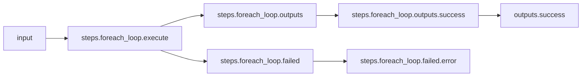
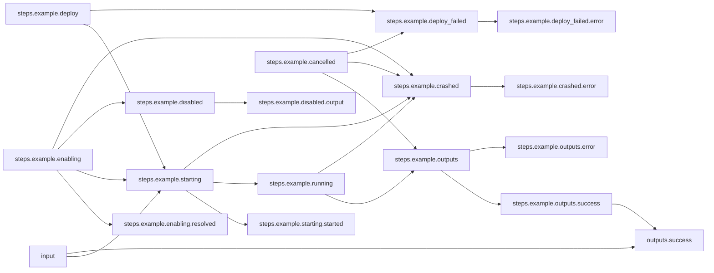

# Binding Repeated Values

## Workflow Description

This workflow demonstrates how to use the Arcaflow builtin function `bindConstants()` to repeat a set of input values with each item in your input list using a foreach loop.

### Subworkflow Description

The subworkflow uses a plugin to print the value of the `name` input.  The `loop_id` and `ratio` input values are bundled with this plugin output as this subworkflow's output. The template plugin is used to simulate an operation on input data and produce an output. In a real world scenario, the subworkflow will likely use more complex plugins with more complex schemas.

## Files

- [`workflow.yaml`](workflow.yaml) -- Defines the workflow input schema and the steps to execute.
  and their data relationships, and the output to present to the user
- [`input.yaml`](input.yaml) -- The input parameters that the user provides for running
  the workflow
- [`config.yaml`](config.yaml) -- Global config parameters that are passed to the Arcaflow
  engine
- [`subworkflow.yaml](subworkflow.yaml) -- Defines the subworkflow input schema and the plugins to execute.
                     
## Running the Workflow

### Workflow Execution

Download a Go binary of the latest version of the Arcaflow engine from: https://github.com/arcalot/arcaflow-engine/releases
 
Run the workflow:
```
$ export WFPATH=<path to this workflow directory>
$ arcaflow -input ${WFPATH}/input.yaml -config ${WFPATH}/config.yaml -context ${WFPATH}
```

## Workflow Diagram 

### Parent workflow


### Sub-Workflow
