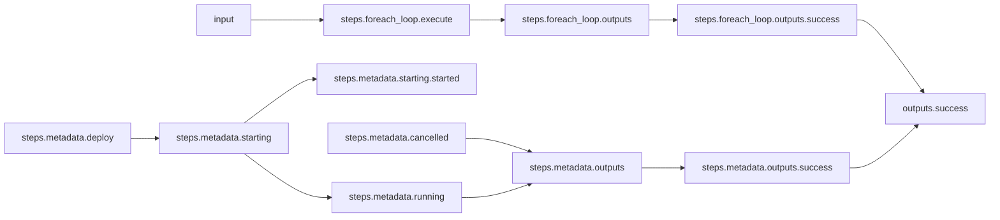
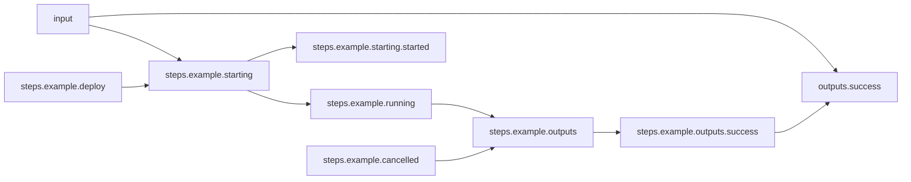

# Looping For-each Sub-Workflow

## Workflow Description

A workflow can iterate over a sub-workflow in a for-each manner by providing a list of input objects compatible with the sub-workflow's schema and specifying `kind: foreach` in the step parameters. The Arcaflow expression language is used to pass the compatible input list object to the `items` parameter of the step.

This workflow runs a metadata collection plugin step in the parent workflow, and then a loop of sub-workflows that each run an example plugin. All steps are run via the default deployer (defined in `config.yaml` as podman) and their success outputs are reported.

## Files

- [`workflow.yaml`](workflow.yaml) -- Defines the workflow input schema, the plugins to run
  and their data relationships, and the output to present to the user
- [`input.yaml`](input.yaml) -- The input parameters that the user provides for running
  the workflow
- [`config.yaml`](config.yaml) -- Global config parameters that are passed to the Arcaflow
  engine
                     
## Running the Workflow

### Workflow Execution

Download a Go binary of the latest version of the Arcaflow engine from: https://github.com/arcalot/arcaflow-engine/releases
 
Run the workflow:
```
$ export WFPATH=<path to this workflow directory>
$ arcaflow -input ${WFPATH}/input.yaml -config ${WFPATH}/config.yaml -context ${WFPATH}
```

## Workflow Diagram (single loop iteration)
### Parent workflow

### Sub-Workflow
