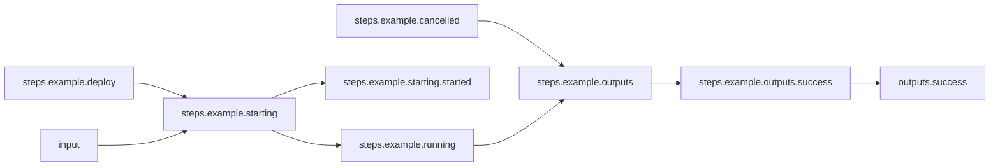

# Basic Workflow

## Workflow Description

This workflow uses a namespaced scope in order to infer the workflow input schema from the plugin step.

Both workflows and plugins have input schemas. When creating a workflow, you have the opportunity to define an input schema that is unique from that of its plugins, allowing you to customze the workflow user experience. When you do not have the need to customize the input schema of a plugin, you can drastically simplify the workflow file by using namespaced scoping. This allows you to reference the schema of a plugin step for use as a workflow schema object.

Without namespaced scoping, you need to define in the workflow `input` section all of the parameters you wish to pass to the workflow user. To represent all features of the example plugin, the workflow input schema might look like this:

```yaml
input:
  root: RootObject
  objects:
    InputParams:
      id: InputParams
      properties:
        name:
          display:
            description: Who do we say hello to?
            name: Name
          examples:
          - '{"_type": "fullname", "first_name": "Arca", "last_name": "Lot"}'
          - '{"_type": "nickname", "nick": "Arcalot"}'
          required: true
          type:
            discriminator_field_name: _type
            type_id: one_of_string
            types:
              fullname:
                display:
                  name: Full name
                id: FullName
                type_id: ref
              nickname:
                display:
                  name: Nick
                id: Nickname
                type_id: ref
    FullName:
      id: FullName
      properties:
        first_name:
          display:
            name: First name
          examples:
          - '"Arca"'
          required: true
          type:
            min: 1
            pattern: ^[a-zA-Z]+$
            type_id: string
        last_name:
          display:
            name: Last name
          examples:
          - '"Lot"'
          required: true
          type:
            min: 1
            pattern: ^[a-zA-Z]+$
            type_id: string
    Nickname:
      id: Nickname
      properties:
        nick:
          display:
            name: Nickname
          examples:
          - '"Arcalot"'
          required: true
          type:
            min: 1
            pattern: ^[a-zA-Z]+$
            type_id: string
    RootObject:
      id: RootObject
      properties:
        example_plugin_params:
          type:
            type_id: ref
            id: InputParams
```

Using a namespaced scope, referencing the input of the `example` step in the workflow, the same workflow `input` schema can be defined like this:
```yaml
input:
  root: RootObject
  objects:
    RootObject:
      id: RootObject
      properties:
        example_plugin_params:
          type:
            type_id: ref
            id: InputParams
            namespace: $.steps.example.starting.inputs.input
```

## Notes

Using namespaced scoping causes all parameters, defaults, required fields, and validations from the plugin to pass through to the workflow object. This means that the workflow input file will need to meet the requirements of the namespace scoped input(s).

For example, if a plugin requires a particular input, you cannot set a default for that input in the workflow `input` section when using a namespaced scope.

If you used a namespaced scope and you want to set a static value for a required plugin input in the workflow `steps` section, you will still need to pass a value to the workflow for this input (this can be a blank value such as `""` or `{}` depending on the object type).

`input.yaml` excerpt:
```yaml
namespace_scoped_input:
  foo: bar
  required_input: ""
```
`workflow.yaml` excerpt:
```yaml
...
input:
  root: RootObject
  objects:
    RootObject:
      id: RootObject
      properties:
        namespace_scoped_input:
          type:
            type_id: ref
            id: InputParams
            namespace: $.steps.my_example_step.starting.inputs.input
...
steps:
  my_example_step:
    input: 
      foo: !expr $.input.namespace_scoped_input.foo
      required_input: my_static_value
...
```

## Files

- [`workflow.yaml`](workflow.yaml) -- Defines the workflow input schema, the plugins to run
  and their data relationships, and the output to present to the user
- [`input.yaml`](input.yaml) -- The input parameters that the user provides for running
  the workflow
- [`config.yaml`](config.yaml) -- Global config parameters that are passed to the Arcaflow
  engine
                     
## Running the Workflow

### Workflow Execution

Download a Go binary of the latest version of the Arcaflow engine from: https://github.com/arcalot/arcaflow-engine/releases
 
Run the workflow:
```
$ export WFPATH=<path to this workflow directory>
$ arcaflow -input ${WFPATH}/input.yaml -config ${WFPATH}/config.yaml -context ${WFPATH}
```

## Workflow Diagram

