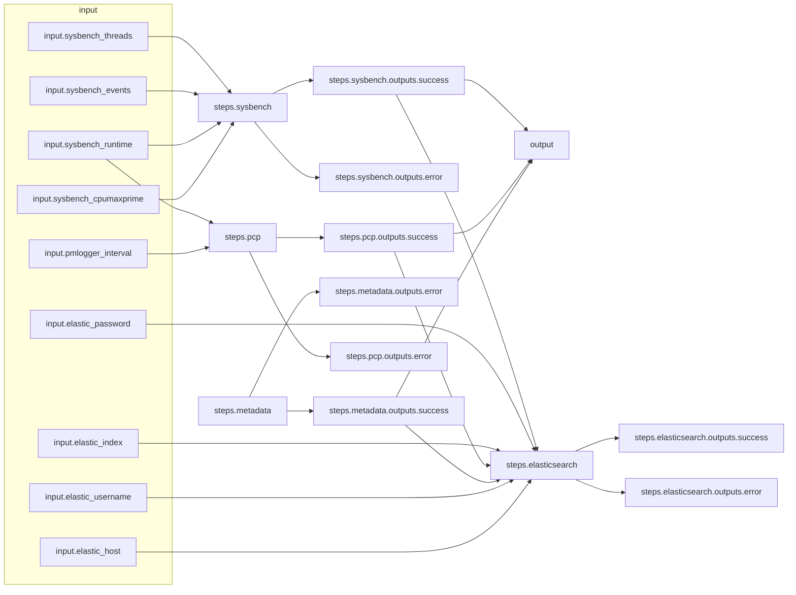

# Example Workflow

***NOTE: This is an example only and may not work out-of-the-box.***

## Workflow Description

This example workflow runs a [sysbench](https://github.com/akopytov/sysbench) CPU workload plugin on the local system.

In addition to the sysbench workload, the workflow collects system metrics with [Performance Co-pilot](https://pcp.io/), and collects system metadata using Ansible [gather facts](https://docs.ansible.com/ansible/latest/collections/ansible/builtin/gather_facts_module.html).

## Files

- [`workflow.yaml`](workflow.yaml) -- Defines the workflow input schema, the plugins to run
  and their data relationships, and the output to present to the user
- [`input.yaml`](input-example.yaml) -- The input parameters that the user provides for running
  the workflow
- [`config.yaml`](config.yaml) -- Global config parameters that are passed to the Arcaflow
  engine
                     
## Running the Workflow

You will need a Golang runtime and Docker to run the containers (Podman can
be used with the [system service](https://docs.podman.io/en/latest/markdown/podman-system-service.1.html)
enabled for socket connections, which are required by the Arcaflow engine to
communicate with the plugins).

Clone the engine:
```
$ git clone git@github.com:arcalot/arcaflow-engine.git
```

Clone this workflows repo, and set this directory to your workflow working directory (adjust as needed):
```
$ git clone https://github.com/arcalot/arcaflow-workflows.git
$ export WFPATH=$(pwd)/arcaflow-workflows/example-workflow
```
 
Run the workflow:
```
$ cd arcaflow-engine
$ go run cmd/arcaflow/main.go -input ${WFPATH}/input-example.yaml \
-config ${WFPATH}/config.yaml -context ${WFPATH}
```

## Workflow Diagram
This diagram shows the complete end-to-end workflow logic.


